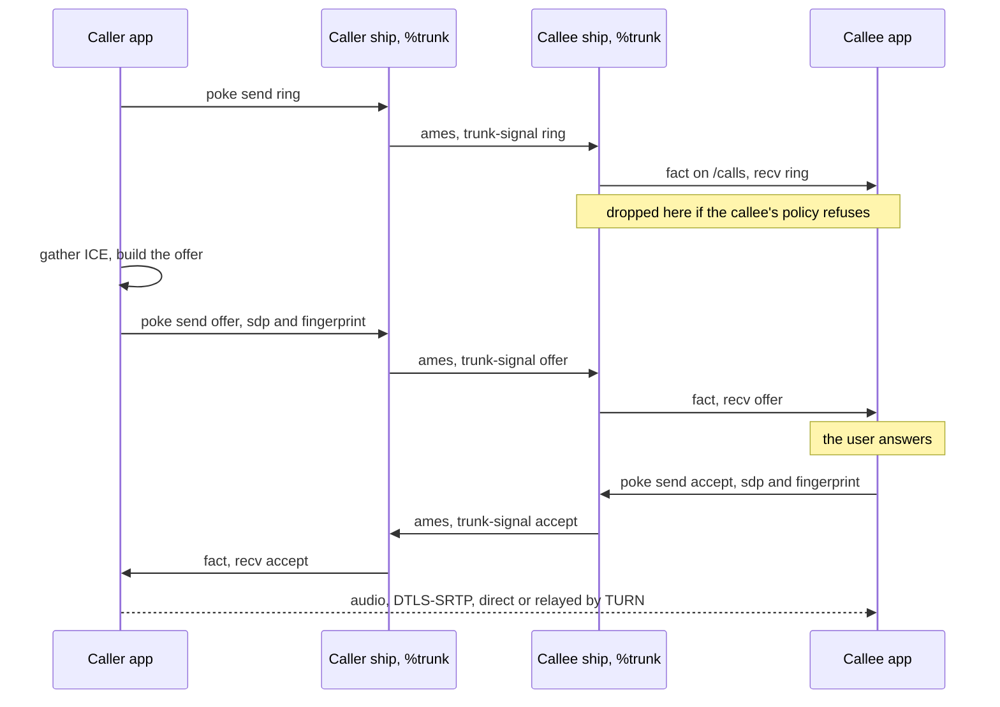
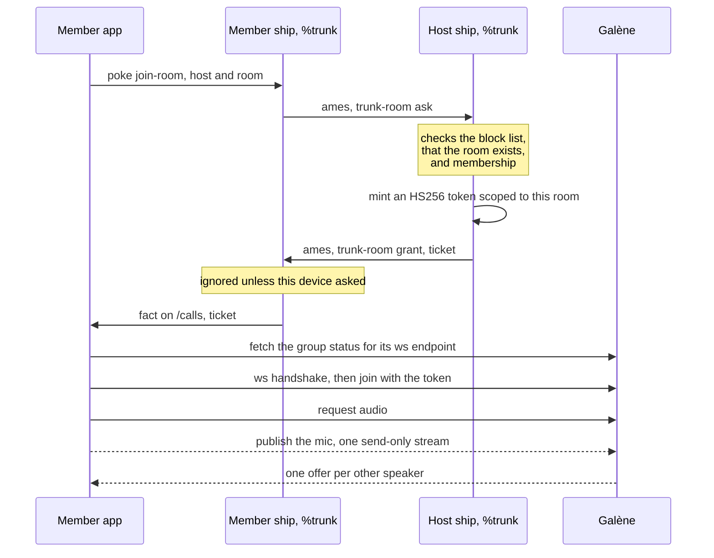
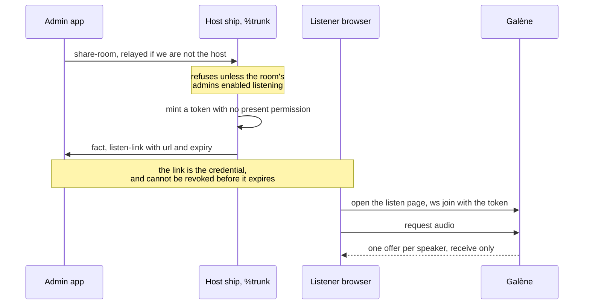

# Trunk

Voice calls and party lines over Urbit.

`%trunk` is a Gall agent that does signalling and nothing else. It
routes opaque SDP between ships for 1:1 calls, and for party lines it
mints short-lived, room-scoped tokens for an SFU. It never sees media
and never parses SDP. Its whole job is the trust boundary: local-only
actions, and a signal's sender is the cryptographic ames source, never
a claim in the payload.

The client is separate. [Talon](https://github.com/nisfeb/talon) is one;
the agent knows nothing about it, or about Tlon groups, or about
anything above the wire.

## Integrating Trunk into your app

Trunk is an agent, not a library. Your app talks to it over the eyre
channel like any other Gall agent, and owns the media itself — Trunk
never touches audio.

**1. Check the wire before anything else.**

```
GET /~/scry/trunk/version.json   ->  {"wire":1}
```

A missing scry means no desk, or one too old to say. A number lower
than yours means the ship needs updating. Say so; otherwise your pokes
are refused by gall and every control in your UI looks dead for no
visible reason. `lib/trunk-json.hoon` is the source of truth for every
shape below, and clients mirror it by hand.

**2. Subscribe to `/calls` on `%trunk`.** Everything the agent tells
you arrives there as JSON: incoming signals, party-line tickets,
refusals, policy changes.

**3. Poke `%trunk` with the `trunk-action` mark** to do anything.

### A 1:1 call

```jsonc
// you -> your ship
{"send": {"ship": "~zod", "sig": {"ring":   {"id": "<call-id>"}}}}
{"send": {"ship": "~zod", "sig": {"offer":  {"id": "...", "sdp": "...", "fpr": "..."}}}}
{"send": {"ship": "~zod", "sig": {"accept": {"id": "...", "sdp": "...", "fpr": "..."}}}}
{"send": {"ship": "~zod", "sig": {"reject": {"id": "...", "reason": "declined"}}}}
{"send": {"ship": "~zod", "sig": {"hangup": {"id": "..."}}}}

// your ship -> you, on /calls
{"recv": {"from": "~zod", "sig": {"ring": {"id": "..."}}}}
```

`from` is the ames source, not a claim in the payload. The SDP should
be complete — gather ICE before you send it — because there is no
trickling over ames. Advertise your ship's ICE servers from
`/~/scry/trunk/ice.json`.

### A party line

```jsonc
// ask the host for a ticket
{"join-room": {"host": "~zod", "name": "lounge"}}

// the host answers, on /calls
{"ticket": {"from": "~zod", "name": "lounge",
            "location": "https://sfu.example/group/talon/zod-lounge/",
            "token": "<jwt>"}}
{"denied": {"from": "~zod", "name": "lounge", "why": "not a member"}}
```

Take the ticket to the SFU: fetch `<location>/.status` for its
websocket endpoint, then join with the token. That is Galène's own
protocol from there on, and its `protocol.js` is a usable client
library.

### Three things that will bite you

- **A ticket is a fact every device of the ship sees.** Only the device
  that asked may act on it, or a desktop joining drags the phone onto
  the line too — one person twice in the roster, and a second stream
  that is nobody talking.
- **So is a ring.** Every device rings, which is the point; but a busy
  device must not reply "busy" on behalf of the others, or a phone
  mid-call cancels a ring the desktop was about to answer.
- **A refusal is silence.** No error comes back when policy declines a
  caller. Your ring timeout is what ends it.

## How a 1:1 call works

Signalling travels through ames, ship to ship. Media never does — it
goes directly between the two clients, and the ships never see it. The
SDP is complete when it is sent: one offer and one answer, no
trickling, because every ames round trip is expensive.



## How a party line works

A line belongs to one host ship, and only that host can mint a ticket
for it. Membership is checked there, on the ship that owns the group —
the same boundary the group's messages already use, extended to audio.
Media goes through the SFU rather than peer to peer, so a line does not
cost each speaker a connection to every other.



A listener is the same room reached without a ship. The token carries
no `present` permission, so Galène will hand it streams and refuse to
take one.



## What's here

```
app/ lib/ mar/ sur/ gen/   the %trunk desk, laid out for a clay mount
sidecar/                   coturn + Galène, and the listen page
docs/design.md             how it works and why
```

## The desk

**It is not self-contained.** Installing needs `default-agent`, `dbug`
and `skeleton` from `%base`, plus the `bill`, `hoon`, `kelvin`, `mime`,
`noun` and `txt` marks. That list is from a working install, not from
memory; a missing mark fails the commit with a mark error rather than
anything helpful.

```dojo
|mount %base
|new-desk %trunk
|mount %trunk
```

```bash
PIER=/path/to/your/pier
cp -r app lib mar sur gen desk.bill "$PIER/trunk/"
cp "$PIER"/base/lib/{dbug,default-agent,skeleton}.hoon      "$PIER/trunk/lib/"
cp "$PIER"/base/mar/{bill,hoon,kelvin,mime,noun,txt}.hoon   "$PIER/trunk/mar/"
# Take the kelvin from YOUR ship. The checked-in one matches whatever
# it was last developed against; a ship on a different one refuses.
cp "$PIER/base/sys.kelvin" "$PIER/trunk/sys.kelvin"
```

```dojo
|commit %trunk
|install our %trunk
```

Both ends of a call need the desk. Read the current settings with
`=dir /=trunk=` then `+trunk/policy`, or over HTTP at
`/~/scry/trunk/policy.json` (eyre supplies the `%x` care itself — do
not put it in the path).

## Who may ring you

```
+$  call-mode  ?(%open %allow)
+$  policy  [mode=call-mode allow=(set ship) block=(set ship)]
```

Enforced in the agent, deliberately. A filter in the client still lets
the poke land, still rings the ship's other clients, and does nothing
at all for a second app sharing the agent.

```dojo
:trunk &trunk-action [%set-call-mode %allow]
:trunk &trunk-action [%allow ~zod]
:trunk &trunk-action [%block ~bus]
```

A refused caller gets **silence**, not a rejection: a rejection would
confirm the ship is live and filtering, and tell a blocked caller they
were blocked. Their ring watchdog gives up on its own, which is what
an offline ship looks like.

The mode gates rings only. Offer, accept and hangup pass even from a
ship the mode would refuse, because *you* may have called *them* — a
client ignores any signal whose call id it doesn't recognise. A block
is total.

## Party lines

One line per group, hosted by one ship, running on an SFU. The host
mints a per-member, per-room token; membership is the whole check.

Rooms carry what their admins decide:

```
+$ room  [title=@t members=(set ship) admins=(set ship)
          listen=? sfu=(unit sfu-config)
          group=(unit group-source)
          join-roles=(unit (set @t)) speak-roles=(unit (set @t))
          muted=(set ship) seat-roles=(map ship (set @t))]
```

`admins` is just "ships that may reconfigure this room" — the agent has
no idea what a group is. A client seeds it from whatever roster it has,
or binds the room to a group source and the roster (and each member's
roles) mirrors it from then on. `sfu` overrides the ship's own sidecar,
so a group needn't route its audio through the host's server. The role
gates are wire 5: `~` for either gate means everyone on the roster,
which is exactly the pre-wire-5 behavior; a set gate admits a member
iff their mirrored roles intersect it, the host and admins bypass both
gates, and `muted` is moderation that beats everything except the host.

### From the dojo

Every action a client can poke works by hand, and a few are genuinely
useful for operating a host. All of these are local-only pokes — run
them on the ship they act for.

```dojo
::  host a room, with yourself as admin
:trunk &trunk-action [%open-room 'lounge' 'The Lounge' (silt ~[~zod ~bus]) (silt ~[our])]

::  join a line someone else hosts (the ticket arrives on /calls)
:trunk &trunk-action [%join-room ~zod 'lounge']

::  ask whether a line exists without joining it. This is the recovery
::  path for a missed invitation: a member whose ship had no %trunk
::  when the host announced (or whose announce was lost) has no other
::  way to learn of the line — a member's peek is answered %announce.
:trunk &trunk-action [%peek-room ~zod 'lounge']

::  bind a hosted room's roster to a group, and unbind it. A room
::  created with a group's slug as its name binds at birth on its
::  own (if %groups is installed and has that group), so this is for
::  older rooms, renamed ones, and deliberately unbinding. Manual
::  rosters are still first-class: nothing needs %groups to work.
:trunk &trunk-action [%bind-room 'v769287' [~ [~hodler-lorfeb 'v769287']]]
:trunk &trunk-action [%bind-room 'v769287' ~]

::  reconfigure a line — on the host, or from any ship on its admin
::  list (the poke relays and the host checks). Empty members/admins
::  keep the existing roster, '' keeps the title, keep-sfu=%.y keeps
::  the sfu, so this exact form is a no-op that re-announces the line
::  to every member — the manual re-delivery for a lost invitation:
:trunk &trunk-action [%configure-room ~zod 'lounge' %.y %.n ~ %.y '' ~ ~]
::                                    host  name  open listen sfu keep title members admins

::  role gates (wire 5): only 'admin'-role seats may join, anyone may
::  speak; then read the gates back (%access-state arrives on /calls)
:trunk &trunk-action [%set-room-access ~zod 'lounge' [~ (silt ~['admin'])] ~]
:trunk &trunk-action [%get-room-access ~zod 'lounge']

::  moderation (wire 5): mute one member for everyone, and undo it
:trunk &trunk-action [%moderate-member ~zod 'lounge' ~bus %.y]
:trunk &trunk-action [%moderate-member ~zod 'lounge' ~bus %.n]

::  anonymous listening: allow it, then mint a one-hour listen link
::  (the url arrives on /calls as listen-link)
:trunk &trunk-action [%set-room-listen 'lounge' %.y]
:trunk &trunk-action [%share-room ~zod 'lounge' 3.600]

::  point the ship at its SFU (base url, Galène group, signing key)
:trunk &trunk-action [%set-sfu 'https://sfu.example' 'talon' '<key>']
```

Read state over HTTP (eyre supplies the `%x` care — don't put it in
the path):

```
/~/scry/trunk/version.json    what wire the desk speaks
/~/scry/trunk/rooms.json      the lines this ship hosts, gates included
/~/scry/trunk/lines.json      the lines this ship holds invitations to
/~/scry/trunk/policy.json     who may ring
/~/scry/trunk/ice.json        the ICE servers this ship advertises
```

The dojo form of the same reads is `.^(json %gx /=trunk=/lines/json)`.

**Anonymous listening** mints a token with no `present` permission —
Galène's listener, receives and cannot publish. It is off unless asked
for: a party line is otherwise gated by the host's membership list, and
a public link deliberately punches through that. The link cannot be
revoked (Galène's tokens are stateless), so its TTL is the entire
security model and the agent caps it at an hour.

## The sidecar

See [`sidecar/`](sidecar/). Galène for party lines, coturn for the
hostile-NAT fallback on 1:1 calls, and `sidecar/listen/index.html` —
Trunk's own one-button listen page.

That page exists because Galène's own client is a video-conferencing
UI: it only displays a remote stream when a track is `kind === 'video'`,
so an audio-only line renders no tile at all, and a tab nobody clicked
cannot autoplay. Getting sound out of it took a settings panel and a
play button. The listen page instead takes the click as both the
autoplay gesture and the connect, and offers nothing a listener can't
use.

## History

Trunk was developed inside the Talon repository and split out once it
worked. Commits before this repo's first are in
[nisfeb/talon](https://github.com/nisfeb/talon), under `urbit/trunk`
and `sidecar`.
