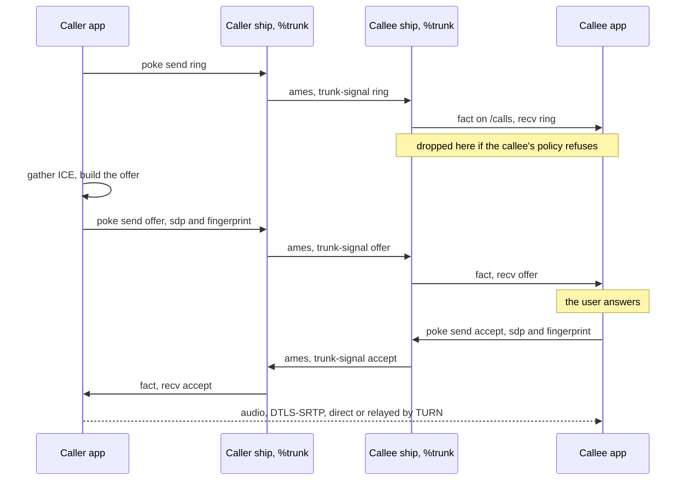
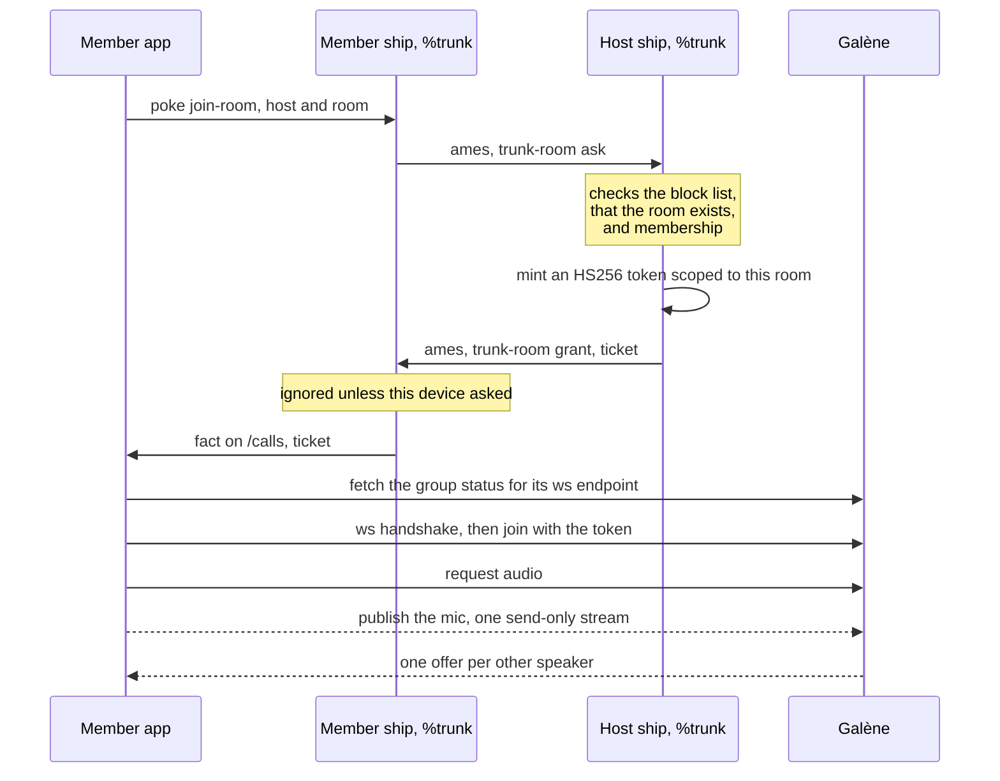
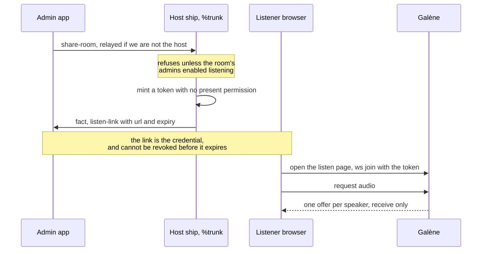

# Trunk

Voice calls, party lines and push notifications over Urbit.

`%trunk` is a Gall agent. It routes opaque SDP between ships for 1:1 calls, and for party lines it mints short-lived, room-scoped tokens for an SFU. It never sees media and never parses SDP. Its job there is the trust boundary: local-only actions, and a signal's sender is the cryptographic ames source, never a claim in the payload.

Since wire 11 it also wakes its owner's phones itself, with push notifications for calls, messages and alerts from other apps on the ship. Since wire 12 it serves its owner a page for those notifications and for debugging them. The one piece left off the ship is signing an iPhone's push with Apple's key, which a small gateway does.

The client is separate. [Talon](https://github.com/nisfeb/talon) is one;
the agent knows nothing about it, or about Tlon groups, or about
anything above the wire.

## Integrating Trunk into your app

Trunk is an agent, not a library. Your app talks to it over the eyre
channel like any other Gall agent, and owns the media itself — Trunk
never touches audio.

**1. Check the wire before anything else.**

```
GET /~/scry/trunk/version.json   ->  {"wire":17}
```

A missing scry means no desk, or one too old to say. A number lower
than yours means the ship needs updating. Say so; otherwise your pokes
are refused by gall and every control in your UI looks dead for no
visible reason. `lib/trunk-json.hoon` is the source of truth for every
shape below, and clients mirror it by hand.

**2. Subscribe to `/calls` on `%trunk`.** Everything the agent tells
you arrives there as JSON: incoming signals, party-line tickets,
refusals, policy changes.

**3. Poke `%trunk` with the `trunk-action` mark** to do anything.

### A 1:1 call

```jsonc
// you -> your ship
{"send": {"ship": "~zod", "sig": {"ring":   {"id": "<call-id>"}}}}
{"send": {"ship": "~zod", "sig": {"offer":  {"id": "...", "sdp": "...", "fpr": "..."}}}}
{"send": {"ship": "~zod", "sig": {"accept": {"id": "...", "sdp": "...", "fpr": "..."}}}}
{"send": {"ship": "~zod", "sig": {"reject": {"id": "...", "reason": "declined"}}}}
{"send": {"ship": "~zod", "sig": {"hangup": {"id": "..."}}}}

// your ship -> you, on /calls
{"recv": {"from": "~zod", "sig": {"ring": {"id": "..."}}}}
```

`from` is the ames source, not a claim in the payload. The SDP should
be complete — gather ICE before you send it — because there is no
trickling over ames. Advertise your ship's ICE servers from
`/~/scry/trunk/ice.json`.

### A party line

```jsonc
// ask the host for a ticket
{"join-room": {"host": "~zod", "name": "lounge"}}

// the host answers, on /calls
{"ticket": {"from": "~zod", "name": "lounge",
            "location": "https://sfu.example/group/talon/zod-lounge/",
            "token": "<jwt>"}}
{"denied": {"from": "~zod", "name": "lounge", "why": "not a member"}}
```

Take the ticket to the SFU: fetch `<location>/.status` for its
websocket endpoint, then join with the token. That is Galène's own
protocol from there on, and its `protocol.js` is a usable client
library.

Galène names everyone by the token's `sub`, so a username on the line is the ship's `@p`, comets included. Galène refuses any later message whose username differs from the token's, so a client must send its `@p` and nothing else. A readable name, such as a nickname or a comet's mnemonym, travels in Galène's per-user data as `"data": {"name": "..."}` on the join, and other clients get it in `user` messages. Hosts on wire 10 to 12 signed a comet in as its full mnemonym instead (up to twelve words joined by dots, one dot in front when the host's Jael holds a Groundwire attestation and two otherwise), and Galène then refused that comet's every message, so comets could not speak there. Wire 13 puts the `@p` back.

### Push hints for an app that is asleep (wire 11)

A phone whose app is suspended hears nothing on `/calls`. Since wire 11 the ship wakes it itself, with a push straight to each device the owner registered. This replaces Talon's off-ship relay, which logged in with the user's `+code` and kept a session cookie. Here the `+code` never leaves the ship. An Android push carries only the hint. An iPhone's alert also carries the author and up to 140 characters of the post, through the gateway and APNs, so iOS can show it.

Register from the device, with a `trunk-action` poke as the owner. `id` is the device's own, minted once. Registering again with the same `id` replaces the entry, so new caps, a new endpoint or a new handle is just another register. A ship keeps at most 32 devices.

```jsonc
// Android, through its UnifiedPush distributor
{"push-register": {"id": "<device id>", "platform": "unifiedpush",
                   "endpoint": "https://ntfy.example/up...", "caps": ["read"]}}
// iPhone, through an APNs gateway that holds the device's tokens
{"push-register": {"id": "<device id>", "platform": "ios-gateway",
                   "gateway": "https://relay.nisfeb.com", "handle": "<h>",
                   "secret": "<s>", "caps": []}}
{"push-unregister": "<device id>"}
// one push to that device at once, past every filter, to prove the path
{"push-test": {"id": "<device id>", "nonce": "<random>"}}
```

An unknown platform, an endpoint or gateway that is not a URL, an empty handle or secret, and a `push-test` for an unknown id all nack.

What gets pushed:

- **ring** when a peer rings us and the policy lets it through, and **ring-cancel** when that ring ends: the caller hangs up (`"reason": "hangup"`), or one of our devices answers or declines (`"answered"`). A cancel goes only to the devices that ring went to, within a minute of it, or within four hours once a device took the call.
- **new-message** for each post or thread reply that `%activity` marks notified, as long as Talon's per-chat level allows it. The level comes from `%settings`, desk `talon`, bucket `notify-prefs`, where each entry is a string of JSON such as `{"level":"mentions"}`. It is `all`, `mentions` or `none`. A channel with no entry of its own takes its group's, kept under the key `group/<flag>` such as `group/~host/name` (wire 15). A chat with neither is at `mentions`, as Talon shows it. At `mentions`, a channel post notifies only when it mentions you, while a DM, a group DM and a reply in a thread you wrote, replied in or were mentioned in always do. Posts more than 5 minutes old never notify, and none is pushed twice. A reply carries `parent`, the id of the post it answers.
- **read** when a chat is read to the end on any client, to devices whose `caps` include `read`, since an older app shows any push it does not know as a new message. An iPhone gets it as a **clear**.
- **notice** when another agent on our ship asks (wire 12), to devices whose `caps` include `notice`. Talon's levels do not apply; the agent decides what is worth it.
- **badge**, an iPhone's app-icon count (wire 12), to iPhones whose `caps` include `badge`. Android has none.
- **push-test** on request.

Any agent on our ship can send a notice, such as a calendar reminder or a time to leave. Another ship cannot. [`docs/notifications.md`](docs/notifications.md) is the guide for app developers; in short:

```jsonc
// wire 14: name the app. A grubbery app must, since its pokes all come from %grubbery
// (see "Grubbery apps" in docs/notifications.md)
{"push-notice-as": {"app": "calendar", "tag": "cal-e1", "title": "Leave now",
                    "body": "Meeting at 3", "open": {"event": "e1"}}}   // open may be null or left out
// wire 12: the same with no app, named after the agent that sent it
{"push-notice": {"tag": "cal-e1", "title": "Leave now", "body": "Meeting at 3"}}
```

`tag` groups and replaces notices on the phone, and `open` is any JSON the app acts on when the notice is tapped. An empty title becomes the app's name, the app name may be 40 bytes, and all the fields together may be 4 KiB. One agent may send under 16 names, and trunk keeps 128 apps, forgetting the one idle longest that the owner never changed. Each app gets at most one push every five seconds: what comes sooner waits, then goes as one push, the notice itself or a summary titled "3 alerts from calendar" with the tag `batch-<agent>` or `batch-<agent>/<app>`. An app gets 30 pushes an hour unless the owner sets another limit for it, up to 720 or none at all. The owner can switch off all notices, or any one app, on the trunk page. Another agent may send notices and nothing else: every other action, settings and devices included, is taken only from the owner's web session, Talon or the dojo. That stops a careless app, not a hostile one, since gall lets an agent name any origin for its poke.

UnifiedPush devices get these bodies, built in the off-ship relay's key order, as `application/json`. Rings, cancels and tests go with `TTL: 60` and `Urgency: high`, notices with `TTL: 3600` and `Urgency: high`, and everything else with `TTL: 86400` and `Urgency: normal`.

```jsonc
{"event": "new-message", "patp": "~ship", "whom": "<chat>", "id": "<post id>"}
{"event": "new-message", "patp": "~ship", "whom": "<chat>", "id": "<reply id>", "parent": "<post id>"}
{"event": "read", "patp": "~ship", "whom": "<chat>"}
{"event": "ring", "patp": "~ship", "from": "~caller", "id": "<call id>"}
{"event": "ring-cancel", "patp": "~ship", "id": "<call id>", "reason": "hangup"}
{"event": "push-test", "patp": "~ship", "nonce": "<nonce>"}
{"event": "notice", "patp": "~ship", "tag": "<tag>", "title": "<title>", "body": "<body>", "open": <json>, "app": "<app>", "via": "<agent>"}
```

A notice's `via` is the agent it came through, sent only when that is not the app's own name.

`whom` is `~ship` for a DM, `0v...` for a group DM and the nest for a channel.

An iPhone needs APNs, which speaks only HTTP/2 with ES256 tokens. Iris has neither, so the ship asks a gateway, `POST <gateway>/gateway/push`, and the gateway maps `handle` to the device's APNs tokens:

```jsonc
// a message, or a test (title "Talon", empty whom and postId, plus "nonce")
{"handle": "<h>", "secret": "<s>", "kind": "alert", "patp": "~ship",
 "whom": "<chat>", "postId": "<post id>", "title": "~author",
 "body": "<the first 140 characters>"}          // plus "parent" on a reply
// a notice: an alert with whom = its tag
{"handle": "<h>", "secret": "<s>", "kind": "alert", "patp": "~ship",
 "whom": "<tag>", "postId": "", "title": "<title>", "body": "<body>",
 "event": "notice", "open": <json>, "app": "<app>", "via": "<agent>"}
// a ring or its cancel: payload is exactly the UnifiedPush body above
{"handle": "<h>", "secret": "<s>", "kind": "voip", "payload": {"event": "ring", ...}}
// a read: the app takes back that chat's notifications
{"handle": "<h>", "secret": "<s>", "kind": "clear", "patp": "~ship", "whom": "<chat>"}
// the app-icon count, with nothing shown
{"handle": "<h>", "secret": "<s>", "kind": "badge", "badge": 3}
```

For an iPhone whose `caps` include `badge`, every message and notice alert also carries `"badge": n`. `n` is `%activity`'s base notify-count, which it gives on `/v4` after each post and read. A message alert carries the count it makes, one more than the last, and `%activity`'s next fact confirms it. When the count moves without an alert, after a read on another client say, it settles for 30 seconds and then goes as a `badge` push to each iPhone told another number.

The ship sends a message, read, notice or badge again when the answer is a 5xx, a 429 or nothing at all: after 30 seconds, then after 5 minutes, then it gives up and logs it. A ring, a cancel and a test are never sent twice, since they are stale in seconds. An answer of 404 or 410 means the device is gone, so the ship drops it. From a gateway, 401 means the same. A device registered again since that push left is kept, and a retry goes only to the target it was meant for. Any other answer is only logged.

### The trunk page (wire 12)

Trunk serves its owner a page at `/apps/trunk`, with a Landscape tile. It holds the ship-wide push switches, a switch for each app that has sent a notice (wire 14), guest links and a switch for each app that asked to host calls (wire 16 and 17), the registered devices with a test button for each, the state of the `%activity` watches, and a log of recent push decisions and failures. A signed-out visitor is sent to the login page. Only the tile's icon at `/apps/trunk/icon.svg` and the guest routes under `/apps/trunk/guest/` are public.

The switches are one more `trunk-action`. Channel posts are `all` (every one `%activity` marks notified), `mentions` or `none`. A thread reply needs its chat's switch and `replies` both. `notices` covers alerts from other agents. An upgrade starts with everything on, which is how wire 11 behaved.

```jsonc
{"push-kinds": {"dm": true, "club": true, "channel": "all",
                "replies": true, "calls": true, "reads": true, "notices": true}}
```

The page posts its actions to `POST /apps/trunk/action` with the same JSON as a poke, and the route hands them to the poke code. It takes `content-type: application/json` only, which a page on another site cannot send without a CORS preflight that eyre refuses. It answers 204 when the action went through, 400 for JSON it cannot read, 415 for anything but JSON, and 422 when trunk refused the action.

Everything the page shows is one owner-only scry, `/~/scry/trunk/debug.json`, so a user can hand it to whoever helps them or to their agent. It never carries a secret, a handle, an endpoint's path or a chat's id: devices show only the host their pushes go to, and the log names the kind of chat, never which one.

Talon reads each device's `sent` and `last` and the `drops` from it, so those names are part of the wire. A `last.code` of 0 means the push got no answer at all.

```jsonc
{"wire": 12, "desk-hash": "0v...", "now": 1791335265091,
 "kinds": {...as above...}, "badge": 3,
 "devices": [{"id": "...", "platform": "unifiedpush", "host": "ntfy.sh",
              "caps": ["read", "notice"], "registered": 1791330000000,
              "sent": {"at": 1791335355100, "kind": "message"},
              "last": {"at": 1791335355181, "code": 200}}],
 "drops": [{"at": 1791335000000, "id": "...", "platform": "ios-gateway", "reason": "410"}],
 "senders": [{"id": "grubbery/calendar", "name": "calendar", "agent": "grubbery",
              "allowed": true, "first": 1791330000000, "last": 1791335000000,
              "hour": 4, "sent": 12, "held": 0, "waiting": 0, "cap": 30}],
 "watches": {"/v4": "live", "/v4/reads": "live"},
 "apps": {"activity": true, "settings": true},
 "log": [{"at": 1791335355181, "what": "DM: pushed to 1 device"}]}
```

### Guest seats (wire 16 and 17)

A ship can host calls that people with no ship join, with audio, video and screen sharing. The owner makes a link to a party line: an invite for a set number of people over a set time (`invite-guests`), or a permanent link under a chosen name for a recurring meeting (`guest-link`, wire 17). A guest opens it, types a name and joins through the ship's own page at `/apps/trunk/guest/<code>`, which is public. Another agent on the ship can also host its own rooms for its own users (`app-room-open`, `app-guest-ticket`), once the owner switches it on.

A guest's Galène username is `guest-` and 12 hex digits, never an `@p`, and a readable name rides in Galène's per-user data. Show guests marked as guests. The guest page publishes the way Talon does: one `camera` stream whose one video sender carries the camera or a shared screen, no simulcast, and the `talon-video` and `talon-mute` usermessages. The live links and the apps that asked are at `/~/scry/trunk/guests.json`. Galène must list the ship's origin in `allowOrigin`, and an https ship needs Galène behind TLS.

[`docs/guest-seats.md`](docs/guest-seats.md) has the whole design, and starts with how to run a recurring meeting.

### Three things that will bite you

- **A ticket is a fact every device of the ship sees.** Only the device
  that asked may act on it, or a desktop joining drags the phone onto
  the line too — one person twice in the roster, and a second stream
  that is nobody talking.
- **So is a ring.** Every device rings, which is the point; but a busy
  device must not reply "busy" on behalf of the others, or a phone
  mid-call cancels a ring the desktop was about to answer.
- **A refusal is silence.** No error comes back when policy declines a
  caller. Your ring timeout is what ends it.

## How a 1:1 call works

Signalling travels through ames, ship to ship. Media never does — it
goes directly between the two clients, and the ships never see it. The
SDP is complete when it is sent: one offer and one answer, no
trickling, because every ames round trip is expensive.


```mermaid
sequenceDiagram
    participant A as Caller app
    participant TA as Caller ship, %trunk
    participant TB as Callee ship, %trunk
    participant B as Callee app

    A->>TA: poke send ring
    TA->>TB: ames, trunk-signal ring
    TB->>B: fact on /calls, recv ring
    Note over TB,B: dropped here if the callee's policy refuses
    A->>A: gather ICE, build the offer
    A->>TA: poke send offer, sdp and fingerprint
    TA->>TB: ames, trunk-signal offer
    TB->>B: fact, recv offer
    Note over B: the user answers
    B->>TB: poke send accept, sdp and fingerprint
    TB->>TA: ames, trunk-signal accept
    TA->>A: fact, recv accept
    A-->>B: audio, DTLS-SRTP, direct or relayed by TURN
```

## How a party line works

A line belongs to one host ship, and only that host can mint a ticket
for it. Membership is checked there, on the ship that owns the group —
the same boundary the group's messages already use, extended to audio.
Media goes through the SFU rather than peer to peer, so a line does not
cost each speaker a connection to every other.


```mermaid
sequenceDiagram
    participant M as Member app
    participant TM as Member ship, %trunk
    participant TH as Host ship, %trunk
    participant G as Galène

    M->>TM: poke join-room, host and room
    TM->>TH: ames, trunk-room ask
    Note over TH: checks the block list,<br/>that the room exists,<br/>and membership
    TH->>TH: mint an HS256 token scoped to this room
    TH->>TM: ames, trunk-room grant, ticket
    Note over TM: ignored unless this device asked
    TM->>M: fact on /calls, ticket
    M->>G: fetch the group status for its ws endpoint
    M->>G: ws handshake, then join with the token
    M->>G: request audio
    M-->>G: publish the mic, one send-only stream
    G-->>M: one offer per other speaker
```

A listener is the same room reached without a ship. The token carries
no `present` permission, so Galène will hand it streams and refuse to
take one.


```mermaid
sequenceDiagram
    participant AD as Admin app
    participant TH as Host ship, %trunk
    participant L as Listener browser
    participant G as Galène

    AD->>TH: share-room, relayed if we are not the host
    Note over TH: refuses unless the room's<br/>admins enabled listening
    TH->>TH: mint a token with no present permission
    TH->>AD: fact, listen-link with url and expiry
    Note over AD,L: the link is the credential,<br/>and cannot be revoked before it expires
    L->>G: open the listen page, ws join with the token
    L->>G: request audio
    G-->>L: one offer per speaker, receive only
```

## What's here

```
app/ lib/ mar/ sur/ gen/   the %trunk desk, laid out for a clay mount
app/trunk/                 the owner's page and the tile's icon, built into the agent
desk.docket-0              the Landscape tile
lib/trunk-push.hoon        what wakes a phone, and the bytes that do it
gen/test-*.hoon            checks to run on a ship, each answering %ok
sidecar/                   coturn + Galène, and the listen page
docs/design.md             how it works and why
docs/notifications.md      how other apps send notifications through trunk
AGENTS.md                  notes for coding agents working on trunk
```

## The desk

**It is not self-contained.** Installing needs `default-agent` and
`skeleton` from `%base`, plus the `bill`, `hoon`, `html`, `kelvin`,
`mime`, `noun`, `svg` and `txt` marks. Since wire 12 the Landscape tile
also needs the `docket-0` mark, `lib/docket` and `sur/docket` from
`%landscape`. That list is from a working install, not from memory; a
missing mark fails the commit with a mark error rather than anything
helpful.

```dojo
|mount %base
|mount %landscape
|new-desk %trunk
|mount %trunk
```

```bash
PIER=/path/to/your/pier
cp -r app lib mar sur gen desk.bill desk.docket-0 "$PIER/trunk/"
cp "$PIER"/base/lib/{default-agent,skeleton}.hoon           "$PIER/trunk/lib/"
cp "$PIER"/base/mar/{bill,hoon,html,kelvin,mime,noun,svg,txt}.hoon "$PIER/trunk/mar/"
cp "$PIER"/landscape/mar/docket-0.hoon "$PIER/trunk/mar/"
cp "$PIER"/landscape/lib/docket.hoon   "$PIER/trunk/lib/"
cp "$PIER"/landscape/sur/docket.hoon   "$PIER/trunk/sur/"
# Take the kelvin from YOUR ship. The checked-in one matches whatever
# it was last developed against; a ship on a different one refuses.
cp "$PIER/base/sys.kelvin" "$PIER/trunk/sys.kelvin"
```

```dojo
|commit %trunk
|install our %trunk
+trunk!test-push
+trunk!test-guest
+trunk!test-mnemonym
```

Each check answers `%ok`, or names the cases that came out wrong. Both ends of a call need the desk. Read the current settings with
`=dir /=trunk=` then `+trunk/policy`, or over HTTP at
`/~/scry/trunk/policy.json` (eyre supplies the `%x` care itself — do
not put it in the path).

## Who may ring you

```
+$  call-mode  ?(%open %allow)
+$  policy  [mode=call-mode allow=(set ship) block=(set ship)]
```

Enforced in the agent, deliberately. A filter in the client still lets
the poke land, still rings the ship's other clients, and does nothing
at all for a second app sharing the agent.

```dojo
:trunk &trunk-action [%set-call-mode %allow]
:trunk &trunk-action [%allow ~zod]
:trunk &trunk-action [%block ~bus]
```

A refused caller gets **silence**, not a rejection: a rejection would
confirm the ship is live and filtering, and tell a blocked caller they
were blocked. Their ring watchdog gives up on its own, which is what
an offline ship looks like.

The mode gates rings only. Offer, accept and hangup pass even from a
ship the mode would refuse, because *you* may have called *them* — a
client ignores any signal whose call id it doesn't recognise. A block
is total.

## Party lines

One line per group, hosted by one ship, running on an SFU. The host
mints a per-member, per-room token; membership is the whole check.

Rooms carry what their admins decide:

```
+$ room  [title=@t members=(set ship) admins=(set ship)
          listen=? sfu=(unit sfu-config)
          group=(unit group-source)
          join-roles=(unit (set @t)) speak-roles=(unit (set @t))
          muted=(set ship) seat-roles=(map ship (set @t))]
```

`admins` is just "ships that may reconfigure this room" — the agent has
no idea what a group is. A client seeds it from whatever roster it has,
or binds the room to a group source and the roster (and each member's
roles) mirrors it from then on. `sfu` overrides the ship's own sidecar,
so a group needn't route its audio through the host's server. The role
gates are wire 5: `~` for either gate means everyone on the roster,
which is exactly the pre-wire-5 behavior; a set gate admits a member
iff their mirrored roles intersect it, the host and admins bypass both
gates, and `muted` is moderation that beats everything except the host.

### From the dojo

Every action a client can poke works by hand, and a few are genuinely
useful for operating a host. All of these are local-only pokes — run
them on the ship they act for.

```dojo
::  host a room, with yourself as admin
:trunk &trunk-action [%open-room 'lounge' 'The Lounge' (silt ~[~zod ~bus]) (silt ~[our])]

::  join a line someone else hosts (the ticket arrives on /calls)
:trunk &trunk-action [%join-room ~zod 'lounge']

::  ask whether a line exists without joining it. This is the recovery
::  path for a missed invitation: a member whose ship had no %trunk
::  when the host announced (or whose announce was lost) has no other
::  way to learn of the line — a member's peek is answered %announce.
:trunk &trunk-action [%peek-room ~zod 'lounge']

::  bind a hosted room's roster to a group, and unbind it. A room
::  created with a group's slug as its name binds at birth on its
::  own (if %groups is installed and has that group), so this is for
::  older rooms, renamed ones, and deliberately unbinding. Manual
::  rosters are still first-class: nothing needs %groups to work.
:trunk &trunk-action [%bind-room 'v769287' [~ [~hodler-lorfeb 'v769287']]]
:trunk &trunk-action [%bind-room 'v769287' ~]

::  reconfigure a line — on the host, or from any ship on its admin
::  list (the poke relays and the host checks). Empty members/admins
::  keep the existing roster, '' keeps the title, keep-sfu=%.y keeps
::  the sfu, so this exact form is a no-op that re-announces the line
::  to every member — the manual re-delivery for a lost invitation:
:trunk &trunk-action [%configure-room ~zod 'lounge' %.y %.n ~ %.y '' ~ ~]
::                                    host  name  open listen sfu keep title members admins

::  role gates (wire 5): only 'admin'-role seats may join, anyone may
::  speak; then read the gates back (%access-state arrives on /calls)
:trunk &trunk-action [%set-room-access ~zod 'lounge' [~ (silt ~['admin'])] ~]
:trunk &trunk-action [%get-room-access ~zod 'lounge']

::  moderation (wire 5): mute one member for everyone, and undo it
:trunk &trunk-action [%moderate-member ~zod 'lounge' ~bus %.y]
:trunk &trunk-action [%moderate-member ~zod 'lounge' ~bus %.n]

::  anonymous listening: allow it, then mint a one-hour listen link
::  (the url arrives on /calls as listen-link)
:trunk &trunk-action [%set-room-listen 'lounge' %.y]
:trunk &trunk-action [%share-room ~zod 'lounge' 3.600]

::  point the ship at its SFU (base url, Galène group, signing key)
:trunk &trunk-action [%set-sfu 'https://sfu.example' 'talon' '<key>']

::  push by hand (wire 11 to 14): register a device, send it a test,
::  switch alerts from other apps off, send an alert as an app would,
::  switch one app off (keeping its hourly limit), and remove the device. Talon does the first
::  and last for you.
:trunk &trunk-action [%push-register 'my-phone' [[%unifiedpush 'https://ntfy.sh/up123'] (silt ~['read' 'notice'])]]
:trunk &trunk-action [%push-test 'my-phone' 'hello']
:trunk &trunk-action [%push-kinds [%.y %.y %all %.y %.y %.y %.n]]
::                                dm  club channel replies calls reads notices
:trunk &trunk-action [%push-notice-as 'calendar' 'cal-1' 'Leave now' 'Meeting at 3' ~]
:trunk &trunk-action [%push-app 'dojo/calendar' %.n 30]
::                                id              allow  pushes an hour (0: no limit)
:trunk &trunk-action [%push-unregister 'my-phone']
```

Read state over HTTP (eyre supplies the `%x` care — don't put it in
the path):

```
/~/scry/trunk/version.json    what wire the desk speaks
/~/scry/trunk/rooms.json      the lines this ship hosts, gates included
/~/scry/trunk/lines.json      the lines this ship holds invitations to
/~/scry/trunk/policy.json     who may ring
/~/scry/trunk/ice.json        the ICE servers this ship advertises
/~/scry/trunk/sfu.json        the SFU's base url and group, never its key
/~/scry/trunk/debug.json      push devices, switches, watches and log
```

The dojo form of the same reads is `.^(json %gx /=trunk=/lines/json)`.

**Anonymous listening** mints a token with no `present` permission —
Galène's listener, receives and cannot publish. It is off unless asked
for: a party line is otherwise gated by the host's membership list, and
a public link deliberately punches through that. The link cannot be
revoked (Galène's tokens are stateless), so its TTL is the entire
security model and the agent caps it at an hour.

## The sidecar

See [`sidecar/`](sidecar/). Galène for party lines, coturn for the
hostile-NAT fallback on 1:1 calls, and `sidecar/listen/index.html` —
Trunk's own one-button listen page.

That page exists because Galène's own client is a video-conferencing
UI: it only displays a remote stream when a track is `kind === 'video'`,
so an audio-only line renders no tile at all, and a tab nobody clicked
cannot autoplay. Getting sound out of it took a settings panel and a
play button. The listen page instead takes the click as both the
autoplay gesture and the connect, and offers nothing a listener can't
use.

## History

Trunk was developed inside the Talon repository and split out once it
worked. Commits before this repo's first are in
[nisfeb/talon](https://github.com/nisfeb/talon), under `urbit/trunk`
and `sidecar`.
